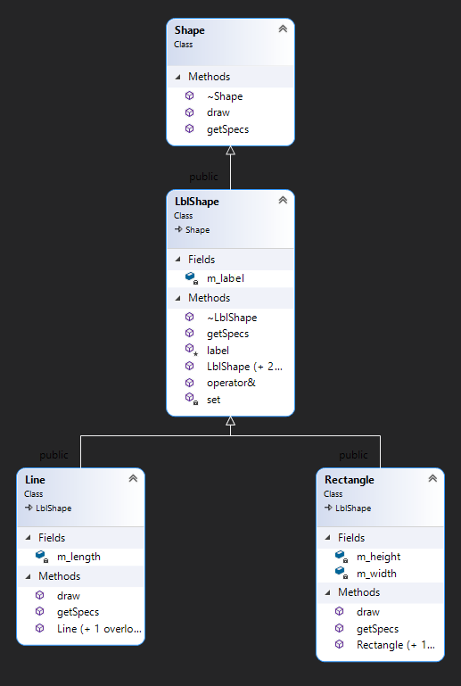

# Workshop #8: Virtual functions and Abstract base classes

In this workshop, you will create a hierarchy of classes to practice and understand the role of virtual functions in inheritance. 
The workshop consists of 4 classes:  
- Shape; encapsulates a shape that can be drawn on the screen<br />
(An interface, that is an abstract base class with only pure virtual functions)
- LblShape; encapsulates a shape that can be labelled <br />
(An abstract base class that represents a labelled shape) 
- Line; encapsulates a horizontal line on a screen with the label <br />
(this concrete class draws a labelled line)
- Rectangle; encapsulates a rectangle on the screen that can be labelled <br />
(this concrete class draws a rectangle with a label inside).


## Learning Outcomes

Upon successful completion of this workshop, you will have demonstrated the abilities to:

- define pure virtual functions
- create abstract base classes
- implement behaviour using virtual functions
- explain the difference between an abstract base class and a concrete class
- describe what you have learned in completing this workshop


> Note: All the code written in workshops and the project must be implemented in the **sdds** namespace.

# lab (part 1) (100%)

Implement four modules for the following classes; **Shape, LblShape, Line** and **Rectangle**




## 1- The `Shape` interface

### Create the following two [Pure virtual functions](https://ict.senecacollege.ca/~oop244/pages/content/abstr.html#pur):
> a [pure virtual function](https://ict.senecacollege.ca/~oop244/pages/content/abstr.html#pur) is a virtual function that has no implementation.  To indicate that the pure virtual function does not have implementation set its prototype to zero (```= 0;```) in the class declaration.

#### draw  
Returns void and receives a reference to **ostream** as an argument.  This pure virtual function can not modify the current object.

#### getSpecs
Returns void and receives a reference to **istream** as an argument. 

### `destructor`
Create a virtual empty destructor for the shape interface. 
> this guarantees that any dynamically allocated derived class from the shape interface pointed by a base class pointer will be removed properly from memory when deleted.

### `Shape` helper functions
Overload the insertion and extraction operators (using draw and getSpecs functions) so any shape object can be written or read using ostream and istream.


## 2- The `LblShape` abstract Class (the Labeled Shape class)
Inherit an abstract class from the interface `Shape` called `LblShape`.  This class adds a label to a `Shape`.

This class will implement the pure virtual function **getSpecs** but will not implement the draw function; therefore it remains abstract.

### Private Member variable
Add a character pointer member variable called **m_label** and initialize it to null.  This member variable will be used to hold the dynamically allocated label for the `Shape`.


### Protected members 
#### ``` label() ```
Add a query called **label** that returns the unmodifiable value of m_label member variable. 

### public members
#### Default (no argument) constructor
Sets the label pointer to null. (You don't need to do this if the **m_label** is already initialized to null)
#### One argument constructor
Allocates memory large enough to hold the incoming Cstring argument pointed by the **m_label** member variable.  Then copies the Cstring argument to the newly allocated memory.
#### Destructor
Deletes the memory pointed by **m_label** member variable.
#### deleted actions
The copy constructor and assignment operator are deleted to prevent copying or assignment of instances of this class.
#### getSpecs
Reads a comma-delimited Cstring form istream: <br /> 
Override the **Shape::getSpecs** pure virtual function to receive a Cstring (a label) from **istream** up to the **','** character (and then extract and ignore the **comma**).  Afterward, follow the same logic as was done in the one argument constructor; allocate memory large enough to hold the Cstring and copy the Cstring into the newly allocated memory. 

## 3- The `Line` concrete class
Line inherits the **LblShape** class to create a horizontal line with a label.

### Private Member variable
Create a member variable called **m_length** to hold the length of the **Line** in characters.

#### Default (no argument) constructor
Sets the **m_length** member variable to zero, and invokes the default constructor of the base class. 
#### Two argument constructor
Receives a Cstring and a value for the length of the line.  Passes the Cstring to the constructor of the base class and sets the **m_length** member variable to the value of the second argument.

#### Destructor
This class has no destructor implemented.

#### getSpecs
Reads comma-separated specs of the **Line** from istream.<br />
This function overrides the **getSpecs** function of the base class as follows.<br />
First, it will call the **getSpecs** function of the base class then it will read the value of the m_length attribute from the istream argument, and then it will ignore The rest of the characters up to and including the newline character **'\n'**.

#### draw
This function overrides the draw function of the base class.<br />
If the **m_length** member variable is greater than zero and the **label()** is not null, this function will first print the **label()** and then go to the new line.  Afterwards it keeps printing the **'='** (assignment character) to the value of the **m_length** member variable.<br />
Otherwise, it will take no action.

For example, if the Cstring returned by the label query is "Separator" and the length is 40, the draw function should insert the following into ostream:

```Text
Separator
========================================
```
## 3- The `Rectangle` concrete class
The Rectangle class inherits the **LblShape** class to create a frame with a label inside.

### Private Member variable
Create two member variables called **m_width** and **m_height** to hold the width and the height of a rectangular frame (number of characters).

#### Default (no argument) constructor
Sets the width and height member variables to zero.  It will also invoke the default constructor of the base class.

#### Three argument constructor
Receives a Cstring for the label, and two values for the width and height of the **Rectangle** from the argument list.  Passes the Cstring to the constructor of the base class and sets the **m_width** and **m_height** member variables to the corresponding values received from the argument list.
However if the **m_height** is less than 3 or **m_width** is less the length of the **label() + 2** it will set the Rectangle to an empty state.

#### Destructor
This class has no destructor implemented.

#### getSpecs
Reads comma-separated specs of the **Rectangle** from istream.<br />
This function overrides the **getSpecs** function of the base class as follows.<br />
First, it will call the **getSpecs** function of the base class, then it will read two comma-separated values from istream for **m_width** and **m_length** and then ignores the rest of the characters up to and including the newline character (**'\n'**).

#### draw
This function overrides the draw function of the base class.<br />
If the Rectangle is not in an empty state, this function will draw a rectangle with a label inside as follows, otherwise, it will do nothing:

First line:<br />
prints '+', then prints the '-' character (m_width - 2) times and then prints '+' and goes to newline.

Second line:<br />
prints '|', then in (m_width-2) spaces it prints the **label()** left justified and then prints '|' and goes to new line.

In next (m_height - 3) lines:<br />
prints '|', (m_width-2) spaces then prints '|' and goes to new line.

Last line: <b />
exactly like first line.

For example, if the Cstring returned by the label query is "Container", the width is 30 and the height is 5, this function should insert the following into ostream:

```Text
+----------------------------+
|Container                   |
|                            |
|                            |
+----------------------------+
```


## `main` Module (supplied)

**Do not modify this module!**  Walk through the code and make sure you understand it.

### Sample Output

```Text
Nothing should be printed between these two lines
------------------------------------
------------------------------------
Separator
==================================================
+----------------------------+
|Container                   |
|                            |
|                            |
+----------------------------+
Enter the following:
>Line two,40<ETNER>
>Line two,40
The following outputs should be the same
The correct output:
Line two
========================================
Your output:
Line two
========================================
Enter the following:
>A 50 by 4 frame to be printed on screen,50,4<ETNER>
>A 50 by 4 frame to be printed on screen,50,4
The following outputs should be the same
The correct output:
+------------------------------------------------+
| A 50 by 4 frame to be printed on screen        |
|                                                |
+------------------------------------------------+
Your output:
+------------------------------------------------+
|A 50 by 4 frame to be printed on screen         |
|                                                |
+------------------------------------------------+
printing Line and Rectangle using Shape pointers:
Line two
========================================
+------------------------------------------------+
|A 50 by 4 frame to be printed on screen         |
|                                                |
+------------------------------------------------+
Reading the data from a file
line one
==========
line two
==============================
line three
==================================================
line four
======================================================================
+-------------+
|Step four    |
|             |
+-------------+
+-----------------------+
|Step three             |
|                       |
+-----------------------+
+---------------------------------+
|Step two                         |
|                                 |
+---------------------------------+
+-------------------------------------------+
|Step one                                   |
|                                           |
+-------------------------------------------+

```


## Submission
### Files to submit
```Text
Shape.h
Shape.cpp
LblShape.h
LblShape.cpp
Line.h
Line.cpp
Rectangle.h
Rectangle.cpp
main.cpp
```

To test and demonstrate the execution of your program use the same data as shown in the output example.


# Part 2: Reflection

Study your final solutions for each deliverable of the workshop **and the most recent milestones of the project**, reread the related parts of the course notes, and make sure that you have understood the concepts covered by this workshop.  **This should take no less than 30 minutes of your time and the result is suggested to be at least 150 words in length.**

Create a file named `reflect.txt` that contains your detailed description of the topics that you have learned in completing this workshop and **the project milestones** and mention any issues that caused you difficulty.

